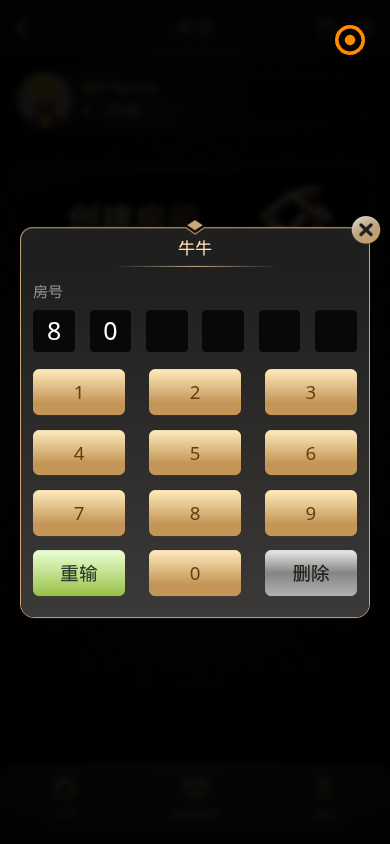
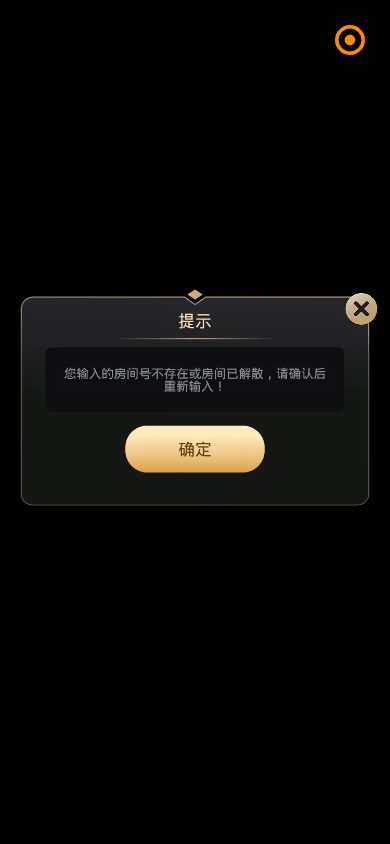

# 金刚牌局 · 牛牛 — 创建 / 加入 / 牌桌 流程分析报告

**测试地址：** https://kingkong.ac/mobile.html → 牌局 → 牛牛  
**子应用路由：** `#/join?gameType=2&jumpType=friend` / `#/detail?room=xxx`  
**测试时间：** 2026-06-18  
**视角：** 产品 · 交互 · 视觉  

---

## 流程概览

```
H5 点「牛牛」→ miniapp loading
  → Join 页（创建房间 / 加入房间）
    → 房号数字键盘弹层（6 位）
      → 成功 → #/detail 牌桌（Cocos）
      → 失败 → 提示弹窗
```

---

## 一、创建房间

**实测路径：** Join 页 → 点击「创建房间」→ 弹出「牛牛 · 房号」数字键盘


### 产品问题

1. **创建与加入首屏相同**：点击「创建房间」后直接进入「输入房号」键盘，与「加入房间」界面一致，用户无法区分是在「开新局」还是「进已有局」。
2. **缺少创建配置**：未见底注、人数、局数、密码、支付方式等创建参数，不符合「创建房间」的产品预期。
3. **房号逻辑反直觉**：创建新房间通常应由系统分配房号，而非让用户输入 6 位数字。
4. **无创建成功反馈定义**：输入满 6 位后会发生什么（进牌桌 / 进等待室 / 报错）对用户不透明。

### 交互问题

1. **两步才能发现创建实质是输房号**：首屏两个大按钮，点击后才暴露键盘，信息架构隐藏过深。
2. **无「确认创建」按钮**：键盘区只有 0–9、重输、删除，满 6 位后是否自动提交不明确。
3. **关闭路径单一**：仅弹层右上角 X，无「返回上一步」文字按钮。
4. **与 Join 页状态无联动**：关闭键盘后回到 Join 页，无任何「上次创建到一半」的恢复提示。

### 视觉问题

1. **弹层标题仍为「牛牛」**：未标明「创建房间」或「输入房号」，与 Join 页主标题重复。
2. **数字键采用 3D 金渐变大按钮**：与后续 SF 统一方向冲突，且「重输」用绿色、「删除」用银色，语义色不统一。
3. **房号输入框 6 格偏小**：无占位提示（如「请输入 6 位房号」），空态辨识度低。
4. **字体非 SF**：键盘与标签使用系统默认栈，与 Figma 规范不一致。

---

## 二、加入房间

**实测路径：** Join 页 → 点击「加入房间」→ 同上「房号」键盘 → 输入房间号



### 产品问题

1. **房号来源无说明**：用户从哪获得 6 位房号（好友分享 / 历史记录）没有任何引导。
2. **余额被「转到平台」**：输入过程中弹出「您的余额已被转到平台，请回到平台查收」，Join 页余额从 ¥77 变为 ¥0.00，用户不理解资金去哪、是否还能开局。
3. **H5 与牌局余额割裂**：H5 顶栏 KKC 与子应用 ¥ 两套余额，加入房间时触发划转，产品规则不透明。
4. **无效房号错误偏技术**：「房间号不存在或房间已解散」未区分两种原因，用户不知该换号还是等房主重开。


### 交互问题

1. **键盘输入无实时校验**：输满 6 位前无任何格式提示（是否必须 6 位、可否字母）。
2. **错误弹窗仅「确定」**：失败后回到键盘，已输入 digits 保留（如「800000」），无「清空重输」快捷操作。
3. **无粘贴 / 扫码加入**：社交组局常见分享链接或二维码，当前仅支持手动逐位输入。
4. **「重输」与「删除」差异不直观**：「重输」清全部 vs「删除」退一位，需试错才懂。
5. **加入与创建共用一套 UI**：误点「创建」也会进入同一键盘，误操作成本高。

### 视觉问题

1. **错误弹窗文案过长**：三行说明挤在深色框内，字号偏小，阅读负担大。
2. **「确定」按钮金渐变大圆角**：与 H5 主站按钮风格、SF 字体规范均不一致。
3. **弹层与 Join 页同时可见**：背景未完全遮罩，层级感弱。
4. **余额 ¥0.00 无强调色**：资金被转走后余额变化不够醒目，易忽略。

---

## 三、在房间里玩游戏

**实测路径：** `#/detail?room=904949&gameType=1`（测试账号历史房间）



> 注：测试账号该 room 已失效，未能进入完整活跃牌局；以下结合路由行为、Cocos 层与历史实测归纳。

### 产品问题

1. **gameType 与游戏不匹配**：从牛牛入口（gameType=2）进入，却打开 `detail?room=904949&gameType=1`（gameType=1 对应炸金花），存在进错游戏类型风险。
2. **无牌桌规则/底注展示**：进入 detail 页面前，用户不知道当前房间规则与带入金额。
3. **牌局进行中余额规则不清**：是否在局内消耗 ¥、何时结算回 H5 KKC，产品说明缺失。
4. **房间解散后无善后引导**：仅提示「房间已解散」，未引导「创建新房间 / 返回大厅选游戏」。

### 交互问题

1. **Vue 壳层空白 + Cocos _canvas 承载**：牌桌 UI 全在 Cocos 内，loading 阶段长时间黑屏，无「正在进入牌桌」反馈。
2. **退出路径混乱**：牌桌内菜单、左上返回、H5 右上关闭圆钮，三套退出方式，用户不确定是否退局还是退 App。
3. **误触易离开牌局**：实测在 detail 页点击底部区域会跳回 `#/home` 全游戏大厅，可能中断对局。
4. **无断线/重连提示**：网络波动时缺少「重新连接牌桌」状态页。
5. **操作反馈依赖 Cocos**：下注、抢庄等关键操作是否有确认、倒计时，自动化无法验证，需真机补测。

### 视觉问题

1. **牌桌 UI 与 Join 页同一黑金体系**：但 Cocos 内字体为 Times New Roman / Helvetica，与 Vue 壳层 PingFang 栈、目标 SF 均不一致。
2. **提示弹窗样式与 Join 页完全一致**：错误 / 余额 / 解散共用同一套弹窗模板，严重级别无法从视觉上区分。
3. **Cocos 渲染期全黑**：加载时无任何品牌 logo 或进度，视觉断层。
4. **帐号 `%Jimmy` 在牌桌流程中持续出现**：贯穿创建 / 加入 / 牌桌，强化「数据异常」印象。

---

## 跨流程共性问题

| 维度 | 问题摘要 |
|------|----------|
| **产品** | 创建≈加入（同一房号键盘）；余额 KKC/¥ 双体系；gameType 路由混乱 |
| **交互** | 关键步骤藏在二级弹层；错误态无下一步引导；退出逻辑多套并存 |
| **视觉** | 全链路未统一 SF；3D 金按钮 / 系统字体 / Cocos 字体三套并存 |

---

## 截图索引

| 文件 | 说明 |
|------|------|
| `screenshots/niuniu-flows/A1-after-create-click-vue.png` | 创建房间 → 房号键盘 |
| `screenshots/niuniu-flows/B1-after-join-click-vue.png` | 加入房间 → 房号键盘 |
| `screenshots/niuniu-flows/B2-join-attempt-vue.png` | 加入过程 → 余额划转提示 |
| `screenshots/niuniu-flows/C1-in-room-vue.png` | 牌桌 → 房间无效/解散提示 |
| `screenshots/niuniu-flows/flow-report.json` | 自动化测试原始数据 |

---

## Figma 设计文件

详见 **汇总** 页 Slide 14–16：

- [Slide 14 · 牛牛 · 创建房间](https://www.figma.com/design/T8PcoyyXrzMoNM5YFlrTJU?node-id=93-2)
- [Slide 15 · 牛牛 · 加入房间](https://www.figma.com/design/T8PcoyyXrzMoNM5YFlrTJU?node-id=93-24)
- [Slide 16 · 牛牛 · 牌桌游戏](https://www.figma.com/design/T8PcoyyXrzMoNM5YFlrTJU?node-id=93-47)
