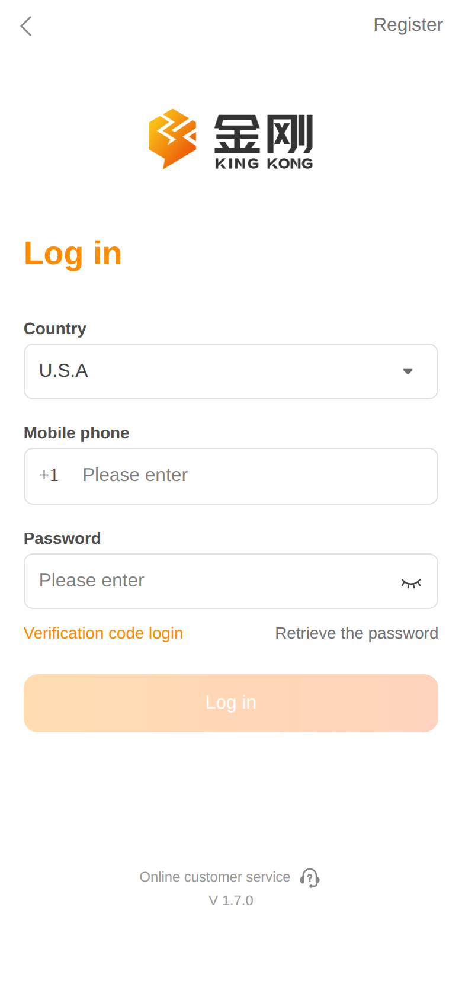
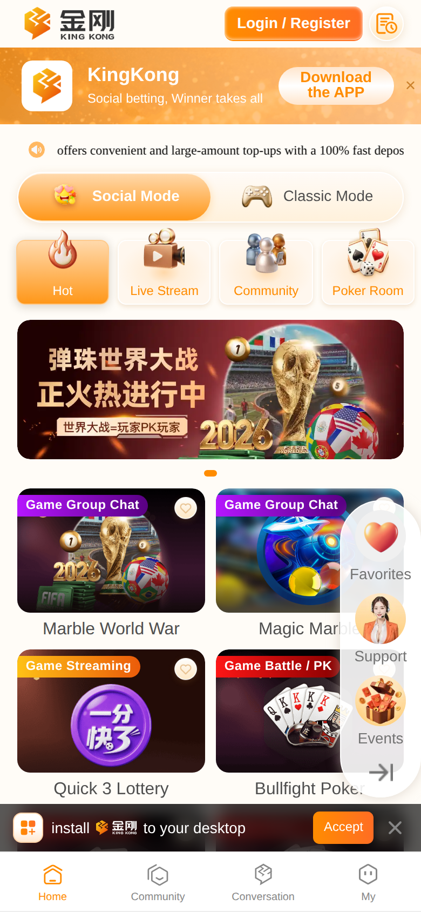
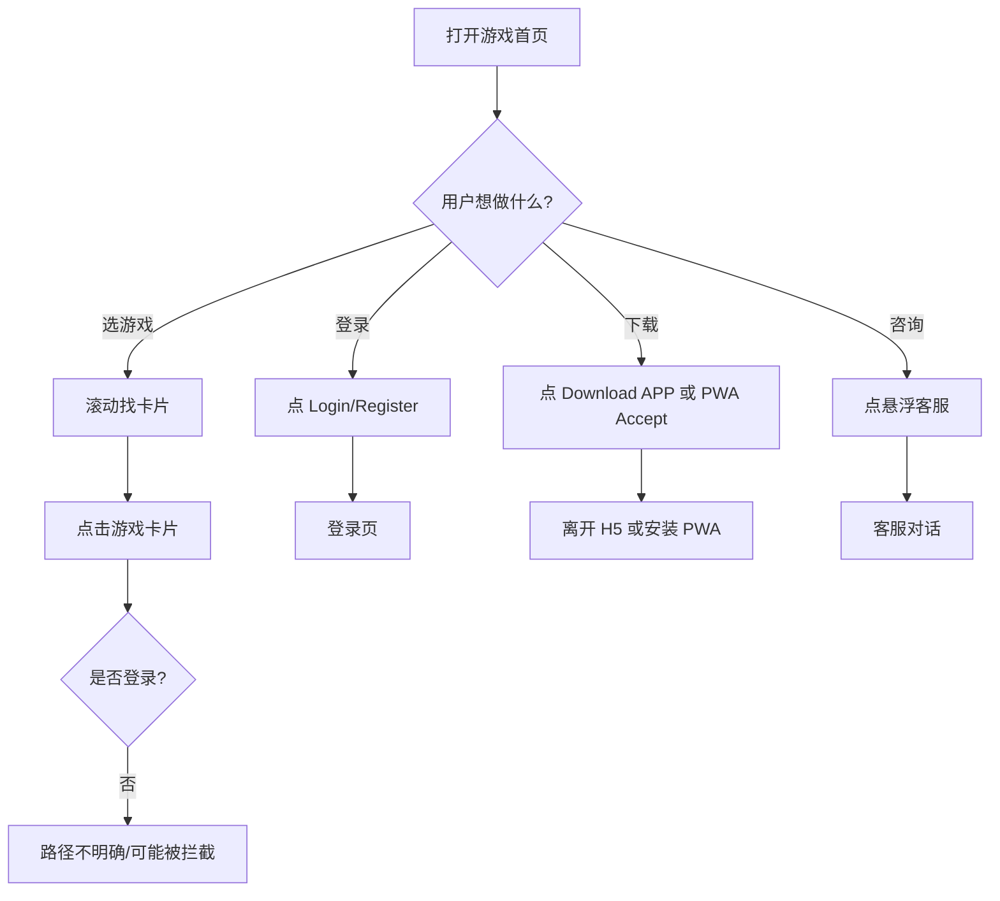
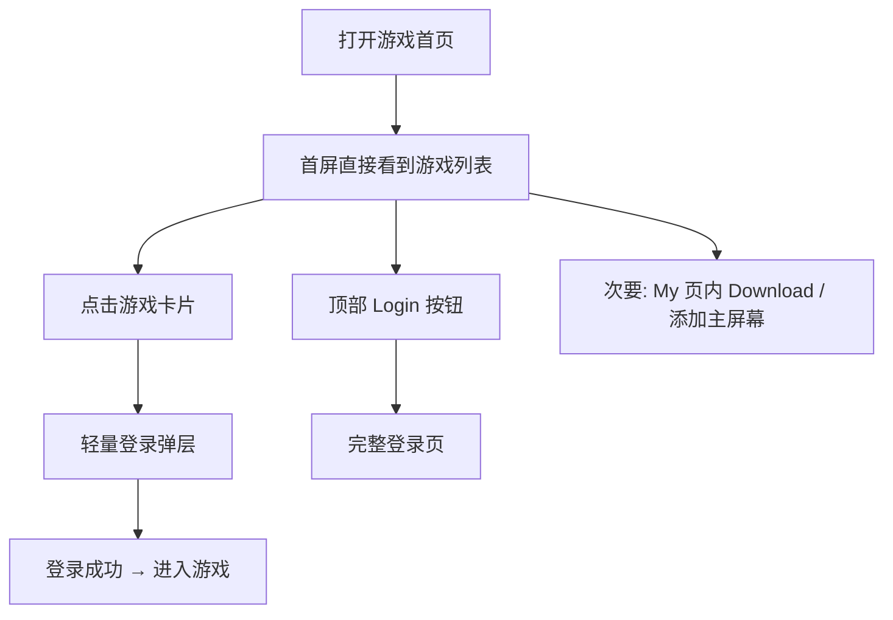
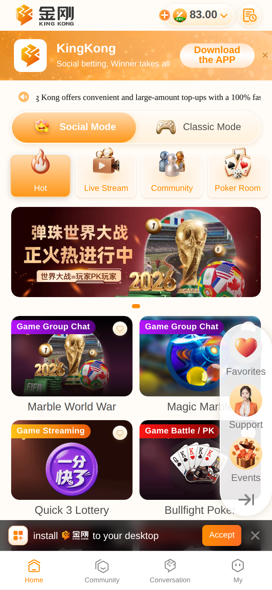
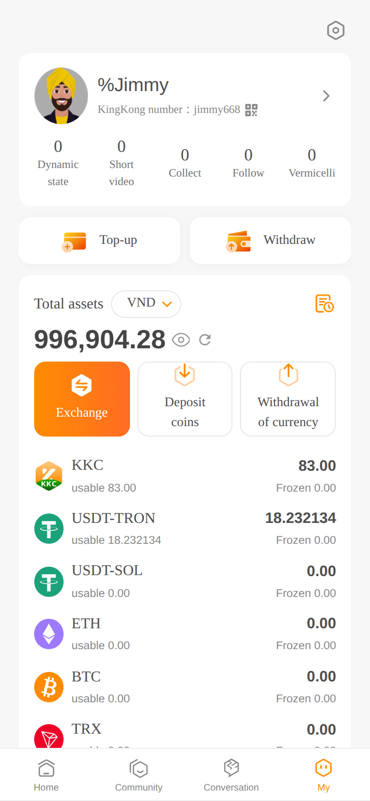
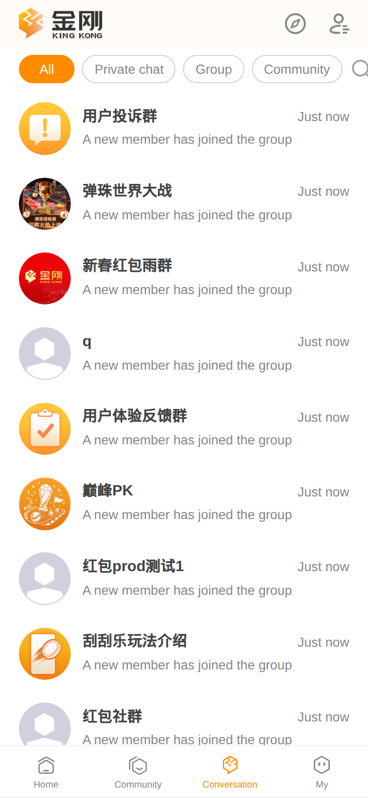
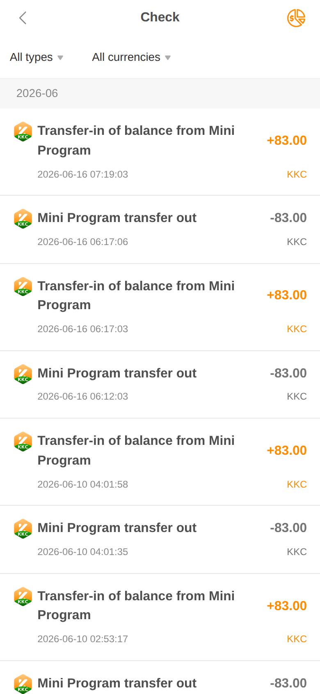
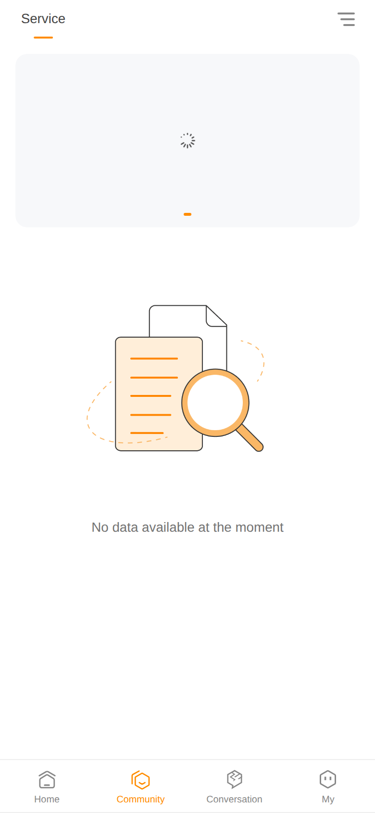

# KingKong H5 交互体验梳理与优化建议

**评测页面：** https://kingkong.ac/mobile.html#/base/game  
**评测时间：** 2026-06-17  
**视角：** 仅交互（用户操作路径、反馈、层级、遮挡）  
**应用版本：** V 1.7.0

---

## 1. 交互概览

KingKong 游戏首页是一个「**多入口、多层导航、多悬浮层**」并存的页面。用户打开 `#/base/game` 后，在**未登录**状态下面对的是「浏览游戏 → 被引导登录/下载/安装」的混合路径，而不是单一的「选游戏 → 进入游戏」路径。

| 交互维度 | 现状 | 优先级 |
|----------|------|--------|
| 主路径是否清晰 | 5+ 个操作入口同时竞争 | P0 |
| 模式切换反馈 | Social / Classic 切换几乎无变化 | P0 |
| 内容是否可操作 | 悬浮层遮挡游戏卡片 | P0 |
| 登录流程 | 表单结构清楚，状态反馈弱 | P1 |
| 底部导航 | 四 Tab 清晰，但与安装条叠加 | P1 |
| 文案是否可理解 | 中英混排、公告截断 | P1 |

---

## 2. 页面交互结构（截图标注）

### 2.1 游戏首页首屏


**当前交互层级（自上而下）：**

```
① 顶栏：Logo | Login/Register | 记录图标
② 营销层：Download APP 横幅（可关闭）
③ 公告层：滚动跑马灯（不可点击展开）
④ 模式层：Social Mode ⇄ Classic Mode
⑤ 分类层：Hot | Live Stream | Community | Poker Room
⑥ 内容层：Banner 轮播 + 游戏卡片网格
⑦ 悬浮层：收藏 | 客服 | 活动（右侧固定）
⑧ 阻断层：PWA 安装条（底部）
⑨ 主导航：Home | Community | Conversation | My
```

**交互问题：** 用户还没开始选游戏，就要先理解 9 层结构；真正可点的「游戏卡片」被推到首屏下半部。

---

### 2.2 登录页



**当前操作路径：**

```
返回 ←  Log in  →  Register（右上角）
        ↓
Country 下拉 → Mobile phone → Password
        ↓
Verification code login    Retrieve password
        ↓
Log in 按钮
        ↓
Online customer service
```

**交互问题：**
- 主按钮在未填完时看起来像「不可点」，用户不确定能否提交
- Register 在右上角，与主流程「登录」距离远，新用户容易漏看
- Country 选了 U.S.A，但用户不一定意识到区号 +1 会随之变化

---

### 2.3 滚动与遮挡



**交互问题：**
- 用户向下滚动浏览游戏时，右侧悬浮条始终挡住右列卡片
- 底部 PWA 安装条与 Tab 栏叠在一起，容易误触「Accept」或 Tab

---

## 3. 核心交互问题梳理

### 3.1 主路径不清晰（P0）

**现象：** 首屏同时引导用户做 5 件不同的事：

| 入口 | 用户预期行为 | 实际冲突 |
|------|--------------|----------|
| Login/Register | 去登录 | 与 Download APP 竞争 |
| Download APP | 去下载原生 App | 与 PWA 安装条重复 |
| PWA Install | 添加到桌面 | 文案写 desktop，移动端困惑 |
| 悬浮客服 | 去咨询 | 遮挡游戏卡片 |
| 游戏卡片 | 进入游戏 | 可能被登录拦截，路径未提前说明 |

**交互建议：**
- 未登录态只保留 **一条主路径**：`浏览游戏 → 点击游戏 → 提示登录 → 登录后进入`
- Login/Register 作为唯一顶部主按钮
- Download / PWA 改为二次引导（首次弹窗或「My」页内），且互斥展示，不要同时出现

---

### 3.2 模式切换无反馈（P0）

**现象：** 点击 Classic Mode 后，页面布局、Banner、游戏列表几乎不变（见截图 07）。


**用户心理：** 「我切换了模式，但什么都没发生 — 是不是点错了？」

**交互建议：**
- 切换时至少改变一项可见内容：Tab 分类、Banner、游戏列表排序
- 增加切换动画或短暂 loading，明确「已切换」
- 当前选中态已有橙色高亮，但内容未联动，选中态意义不足

---

### 3.3 悬浮层干扰主操作（P0）

**现象：**
- 右侧固定工具条覆盖游戏卡片右下角（含收藏心形按钮区域）
- 底部安装条占用 Tab 上方空间，滚动时仍不消失

**交互建议：**
- 悬浮工具条默认 **收成一个 FAB**，点击再展开
- PWA 安装改为 **非阻断 Toast** 或只在第二次访问时出现
- 关闭横幅/安装条后，记住用户选择，当次会话不再弹出

---

### 3.4 分类导航层级重复（P1）

**现象：** 页面上存在两套导航，职责重叠：

| 层级 | 选项 | 作用 |
|------|------|------|
| 模式 Tab | Social / Classic | 切换产品形态 |
| 分类按钮 | Hot / Live / Community / Poker | 切换内容类型 |
| 底部 Tab | Home / Community / Conversation / My | 切换主模块 |

**交互问题：** Community 在分类按钮和底部 Tab 各出现一次，用户不清楚区别。

**交互建议：**
- 明确分工：模式 Tab 管「看什么类型的游戏」，底部 Tab 管「去哪个模块」
- 若 Community 是同一功能，只保留一处入口
- Hot 已有选中态，切换其他分类时应有列表刷新反馈

---

### 3.5 游戏卡片交互（P1）

**现象：**
- 卡片带标签：Game Group Chat / Game Streaming / Game Battle
- 右上角有心形收藏按钮
- 点击卡片本身会做什么，页面上没有说明（进游戏？进房间？需登录？）

**交互建议：**
- 未登录点击卡片：弹出轻量登录引导，而非直接跳转或静默失败
- 收藏按钮与卡片点击区域分离，避免误触（目前收藏按钮靠近悬浮层，更易误操作）
- 标签文案可点击了解含义（如「Game Group Chat」是什么）

---

### 3.6 登录页交互（P1）

**现象：**

| 元素 | 交互状态 | 问题 |
|------|----------|------|
| Log in 按钮 | 浅色渐变 | 像 disabled，用户不敢点 |
| 表单字段 | 无即时校验 | 点提交才知道哪里错 |
| Verification code login | 与主流程同级 | 分流了主路径 |
| Register | 右上角小字 | 发现成本高 |

**交互建议：**
- 按钮区分三种态：**不可点 / 可点 / 加载中**，不可点时也要有足够对比度
- 输入时即时校验（手机号格式、密码长度）
- Register 放到 Log in 按钮下方：「还没有账号？Register」
- Country 变更时，区号字段同步变化并给予短暂提示

---

### 3.7 公告与文案影响操作理解（P1）

**现象：**
- 滚动公告英文被截断，用户读不完，不知道要不要点
- UI 英文 + 游戏中文名混排，操作标签理解成本更高
- PWA 条写「install to desktop」，在手机上不符合用户心智

**交互建议：**
- 公告改为 **可点击展开** 或进入公告列表
- 同一页面统一语言
- 安装引导按场景显示：手机 →「添加到主屏幕」，桌面 →「安装到桌面」

---

## 4. 用户路径梳理

### 4.1 当前路径（未登录）



**问题：** 用户最自然的动作是 C→G，但系统在 A 就同时推 D 和 E，路径分叉过多。

### 4.2 建议路径（未登录）



---

## 5. 交互优化清单

### P0 — 优先改

| # | 问题 | 改什么 | 用户感受 |
|---|------|--------|----------|
| 1 | 入口太多 | 首屏只留 Login + 游戏列表 | 「我知道该干嘛」 |
| 2 | 模式切换无效 | 切换后列表/Banner 要变 | 「切换有反应」 |
| 3 | 悬浮层挡内容 | 改为可收起 FAB | 「点游戏不会误触别的」 |
| 4 | 安装条阻断 | 改 Toast + 记住关闭 | 「不再被挡 Tab」 |

### P1 — 其次改

| # | 问题 | 改什么 |
|---|------|--------|
| 5 | 点游戏不知后果 | 未登录点卡片 → 登录引导 |
| 6 | 登录按钮状态 | 明确 disabled / active / loading |
| 7 | Community 重复 | 合并或区分命名 |
| 8 | 公告不可交互 | 可点击展开 |
| 9 | Register 难发现 | 移到登录按钮下方 |

### P2 — 体验增强

| # | 建议 |
|---|------|
| 10 | 收藏成功后给 toast 反馈 |
| 11 | 分类切换加列表刷新动画 |
| 12 | 底部 Tab 当前页高亮保持一致（Home 已 OK） |

---

## 6. 底部 Tab 交互（实测）

| Tab | 路由 | 未登录能否进入 | 实际表现 |
|-----|------|----------------|----------|
| **Home** | `#/base/game` | ✅ | 游戏首页，可浏览 |
| **Community** | `#/base/community` | ✅ | Service 页，空态「No data available」 |
| **Conversation** | — | ❌ | **立即跳登录** `redirect=/base/service` |
| **My** | `#/base/my` | ⚠️ 半开放 | 可预览个人中心，资产显示 `--` |

**交互问题：** 四个 Tab 的「门槛」不一致——Community/My 能进，Conversation 强制登录，用户难以理解规则。

---

## 7. 登录后交互路径（已实测）

> 以下基于真实账号登录后的浏览器实测（2026-06-17）。截图见 `screenshots/logged-in/`。

### 7.1 登录流程实测

| 步骤 | 交互 |
|------|------|
| 打开 `#/login` | Country 默认 U.S.A，区号 +1 |
| 输入手机号 | 必须填 **`type=tel`** 字段（非 Search 框） |
| 输入密码 | 按钮从 `login-button-disable` 变为可点 |
| 点击 Log in | 成功 → 跳转 **`#/base/game`**，顶栏显示余额 **83.00 KKC** |



**登录后仍存在的问题：** Download APP 横幅、PWA 安装条仍在，对已登录用户属于干扰。

### 7.2 四 Tab 登录后实测

| Tab | 实际路由 | 登录后表现 |
|-----|----------|------------|
| **Home** | `#/base/game` | 顶栏余额 83.00，游戏列表正常 |
| **Community** | `#/base/community` | 仍为空态「No data available」 |
| **Conversation** | **`#/base/service`** | 会话列表，非 URL 中的 conversation |
| **My** | `#/base/my` | 完整个人中心 + 多币种资产 |

### 7.3 My 页交互结构（登录后）



**用户信息：** %Jimmy · KingKong number: jimmy668 · 可进个人详情  
**社交数据：** Dynamic state / Short video / Collect / Follow / Vermicelli（均为 0）  
**快捷操作：** Top-up · Withdraw  
**总资产：** VND **996,904.28**（可切换币种显示）  
**主操作：** Exchange · Deposit coins · Withdrawal of currency  
**币种列表：** KKC 83.00 · USDT-TRON 18.23 · ETH/BTC/TRX 等  
**功能列表（需下滑）：**

| 入口 | 推断路由 | 交互说明 |
|------|----------|----------|
| Payment method | `/transactionMethod/*` | 绑定钱包/微信等 |
| Live streaming center | — | 直播中心 |
| Favorites | `game/my-favorites` | 游戏收藏 |
| Invite friends | `/invite` | 邀请记录 `/invite/records` |
| Universal promotion | `/agent` 等 | 推广/代理 |
| 设置齿轮 | `/setting` | 进入设置中心 |

**登录后交互问题：**
- 币种列表很长，需大量滚动才能看到 Payment method / Favorites 等
- 「Vermicelli」应为 Followers，翻译影响理解
- Exchange / Deposit / Withdraw 三个按钮并列，主操作层级可再清晰

### 7.4 Conversation 消息（登录后实测）



**路由：** 点 Tab「Conversation」→ **`#/base/service`**（URL 与 Tab 名不一致）

**页内结构：**
- 顶栏：发现 · 加好友/建群
- 筛选：**All · Private chat · Group · Community** + 搜索
- 列表：多个群聊（用户投诉群、弹珠世界大战、红包群等）
- 每条预览文案均为 **「A new member has joined the group」**，信息密度低

**交互问题：**
- Tab 叫 Conversation，URL 是 `/base/service`，用户分享链接时会困惑
- 群列表系统消息同质化，难以区分活跃群
- 筛选 Tab 与底部 Community Tab  again 概念重叠

### 7.5 账单页（#/bill）



- 标题 **Check**（非 Bill）
- 筛选：All types · All currencies · 按月分组
- 记录：Mini Program 转入/转出 KKC ±83.00

### 7.6 设置页（登录后）

- Account and Security · Privacy settings · Notification（未登录不可见）
- Language Settings · Help and feedback

### 7.7 钱包 / 资金二级路径

```
My → Top-up          → 充值流程
My → Withdraw        → /withdraw
My → Trading         → /transfer · /transfer/record
My → Deposit coins   → 入金
My → Payment method  → /transactionMethod/addWallet 等
My → Bill（推断）    → /bill
                     → /bonusD · /cashRebate · /currencyExchange · /internationalTransfer
```

### 7.8 Community 社区路径



**登录前后均为空态** — Service 页无内容，用户从 Tab 进入后无下一步引导。

---

## 8. 登录态交互问题汇总（实测更新）

| 优先级 | 问题 | 建议 |
|--------|------|------|
| P0 | 登录后仍有 Download/PWA 横幅 | 已登录用户隐藏营销层 |
| P0 | Conversation Tab ↔ URL `/base/service` 不一致 | 统一命名或 URL |
| P0 | Community 登录后仍空 | 空态增加「去 Home 选游戏」引导 |
| P1 | 群列表预览全是 join group 系统消息 | 显示真实最后一条消息 |
| P1 | My 页币种列表过长 | 折叠次要币种，功能入口上提 |
| P1 | 账单页标题 Check vs 入口 Bill | 统一文案 |
| P2 | 登录表单 tel/text 双输入易填错 | 隐藏或移除 Search 型 input |

---

## 9. Figma 设计文件

交互梳理已按 **「16:9 幻灯片 + 截图 + 现状问题 / 优化建议」** 格式整理（参考现金系统文档结构）：

**[KingKong H5 交互梳理 — 汇总页](https://www.figma.com/design/T8PcoyyXrzMoNM5YFlrTJU?node-id=15-2)**

| 幻灯片 | 主题 |
|--------|------|
| 封面 | KingKong H5 交互优化建议 · 现状及问题整理 |
| 01 | 首屏信息架构 |
| 02 | 登录流程 |
| 03 | 底部 Tab 权限与命名 |
| 04 | My 页（登录后实测） |
| 05 | Conversation 消息 |
| 06 | 登录后 Home 营销层残留 |
| 07 | 账单页文案与信息 |

---

## 10. 截图索引

| 文件 | 交互关注点 |
|------|------------|
| `01-initial-load.png` | 首屏入口层级、遮挡关系 |
| `04-login-page.png` | 登录表单、按钮状态 |
| `07-classic-mode.png` | 模式切换反馈缺失 |
| `14-tab-community.png` | Community Tab 空态 |
| `17-tab-my.png` | My 半开放预览、金融入口 |
| `13-setting-guest.png` | 设置页公开项 |
| `logged-in/10-after-login.png` | 登录后 Home，顶栏余额 |
| `logged-in/11-tab-my.png` | 登录后 My，多币种资产 |
| `logged-in/11-tab-conversation.png` | 登录后会话列表 |
| `logged-in/12-bill.png` | 账单流水 |

---

## 11. 说明

- **未登录 / 登录态：** 均已实测截图  
- **Figma 文件：** 交互地图与优化清单  
- **安全提示：** 请勿在聊天/代码库中保存账号密码；测试完成后建议修改密码

---

*报告视角：交互体验 · Cursor Cloud Agent*
