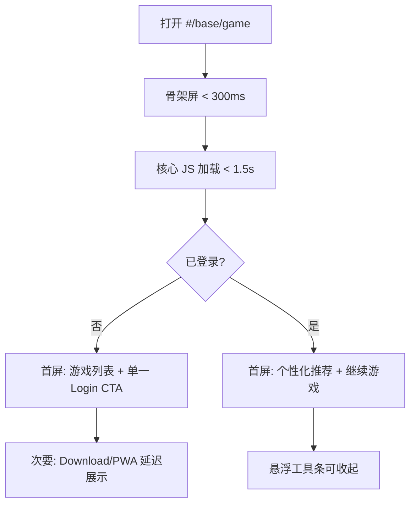

# KingKong H5 游戏体验与优化建议报告

**评测页面：** https://kingkong.ac/mobile.html#/base/game  
**评测时间：** 2026-06-17  
**评测方式：** iPhone 视口（390×844）Headless Chrome 真机 UA 访问 + 静态资源分析  
**应用版本：** V 1.7.0（登录页 footer）

---

## 1. 执行摘要

KingKong 移动端 H5 在视觉呈现上信息密度高、功能入口完整，具备 PWA 能力、启动骨架屏和资源自愈机制等工程化亮点。但在 **首屏性能、信息层级、无障碍、多语言一致性** 方面存在明显可优化空间。

| 维度 | 当前表现 | 优先级 |
|------|----------|--------|
| 首屏加载 | FCP ≈ 4.2s，完整空闲 ≈ 11s | P0 |
| 资源体积 | JS 合计 ≈ 2.2MB，请求 128+ 次 | P0 |
| 首屏信息架构 | 5+ 个 CTA 同时竞争注意力 | P0 |
| 无障碍 | 28/28 图片无 alt，5 处点击热区 < 44px | P1 |
| 国际化 | 中英混排，公告栏英文被截断 | P1 |
| PWA 引导 | 移动端出现 “install to desktop” 文案 | P1 |

---

## 2. 页面体验截图

### 2.1 游戏首页（`#/base/game`）首屏


**观察：**
- 顶部同时存在：Logo、Login/Register、Download APP 横幅、滚动公告
- 中部：Social Mode / Classic Mode 双 Tab + Hot/Live/Community/Poker 四宫格
- 右侧：悬浮工具条（收藏 / 客服 / 活动）
- 底部：PWA 安装条 + 四 Tab 导航（Home / Community / Conversation / My）

首屏 **垂直空间被营销层占去约 40%**，游戏卡片区域被推至中部以下。

### 2.2 登录页


**观察：**
- 表单结构清晰：国家 / 手机号 / 密码
- 主按钮在未填完表单时对比度偏低，像“不可点击”状态
- Register 入口在右上角，字号小、与主流程距离远
- 底部客服入口与版本号 V 1.7.0 可见

### 2.3 滚动后内容区


**观察：**
- 游戏卡片采用 2 列网格，带「Game Group Chat / Game Streaming / Game Battle」标签
- 右侧悬浮条在滚动时仍固定，持续遮挡右侧卡片内容
- 底部 PWA 安装条与 Tab 栏叠加，进一步压缩可视区域

---

## 3. 性能分析

### 3.1 核心指标（实测）

| 指标 | 数值 | 建议目标 |
|------|------|----------|
| DOM Content Loaded | 2.57s | < 1.8s |
| Load Event | 2.58s | < 3.0s |
| First Contentful Paint (FCP) | **4.19s** | < 1.8s |
| networkidle 完成 | **~11s** | < 5s |
| 总请求数 | 128–133 | < 60 |
| 图片请求 | 75–78 | < 30（首屏） |
| 已知传输体积 | ~2.34 MB | < 1.2 MB |

### 3.2 静态资源体积

| 资源 | 体积 | 说明 |
|------|------|------|
| `mobile_3db6d407.js` | 1.17 MB | 主业务包，过大 |
| `6687_943cd69d.js` | 616 KB | 公共依赖 chunk |
| `3133_57334fff.js` | 255 KB | 路由/模块 chunk |
| `867_f03fab82.js` | 112 KB | — |
| `6613_7a0241d7.js` | 97 KB | — |
| CSS 合计 | ~108 KB | 4 个 stylesheet |
| HTML | 10.5 KB | 含内联骨架屏样式 |

**问题：** 首屏 HTML 同步引用 5 个 defer JS + 4 个 CSS，即使用户只看游戏列表，也要下载接近 **2.2MB JS** 才能交互。

### 3.3 已有优点

1. **内联 Boot Skeleton**：`kk-boot-skeleton` 在 JS 未就绪前提供占位 UI，减少白屏感
2. **资源自愈**：`entry-resource-recovery` 对 js/css/wasm 加载失败自动 reload
3. **PWA Manifest**：支持 Add to Home Screen
4. **CSP 配置**：有 `content-security-policy` 头，安全基线较好

---

## 4. UX / UI 问题详解

### 4.1 信息层级混乱（P0）

首屏同时出现以下转化入口，用户难以判断主路径：

```
Login/Register  →  Download APP  →  滚动公告  →  PWA Install  →  右侧客服/活动
```

**建议：**
- 未登录用户：保留 **1 个主 CTA**（Login/Register），Download APP 改为二级入口或首次访问弹窗（可关闭且记住选择）
- PWA 安装条：仅在 `beforeinstallprompt` 或 iOS「添加到主屏幕」引导时出现，且文案区分 mobile/desktop
- 滚动公告：缩短高度，支持点击展开详情

### 4.2 悬浮层遮挡内容（P0）

右侧 Fixed 工具条覆盖游戏卡片右下角，底部 Install 条与 Tab 栏叠加。

**建议：**
- 悬浮条默认收起为 FAB，点击展开
- Install 条上移或改为非阻塞 Toast
- 为 `safe-area-inset-bottom` 预留足够 padding

### 4.3 中英混排与文案截断（P1）

- UI 标签多为英文，Banner/游戏名为中文
- 顶部公告英文在窄屏下被截断：`...ffers convenient and large-amount top-ups...`

**建议：**
- 按 locale 统一语言包，避免硬编码混排
- 跑马灯使用 CSS 动画 + 完整文本，或改为可点击的公告列表

### 4.4 Social / Classic 模式切换反馈弱（P1）

点击 Classic Mode 后，页面视觉变化不明显（截图 07 与 Social 模式几乎一致）。

**建议：**
- 切换时更新列表数据源、Banner、分类 Tab
- 增加过渡动画或骨架屏，给用户明确反馈

### 4.5 登录页可用性（P1）

- 主按钮渐变色过浅，disabled/active 状态区分不足
- 「Verification code login」与「Retrieve password」同级展示，主路径不够突出

**建议：**
- 未满足校验时降低 opacity 但保持足够对比度
- 手机号输入联动 Country 区号（当前固定 +1）

---

## 5. 无障碍与移动端规范

| 检查项 | 结果 | 标准 |
|--------|------|------|
| 图片 alt 文本 | **0/28 有 alt** | WCAG 1.1.1 |
| 点击热区 < 44px | **5 处** | Apple HIG / Material |
| `user-scalable=no` | 已禁用缩放 | 影响低视力用户 |
| 色彩对比 | 浅灰 placeholder 偏低 | WCAG AA 4.5:1 |

**建议：**
- 所有游戏缩略图、Icon 按钮补全 `alt` 或 `aria-label`
- 移除 `maximum-scale=1.0,user-scalable=no`，或仅在游戏全屏页面临时启用
- 悬浮按钮最小 44×44pt

---

## 6. 技术架构优化建议

### P0 — 立即收益

| # | 建议 | 预期收益 |
|---|------|----------|
| 1 | **路由级 Code Splitting**：`/base/game` 首屏不加载 Chat/Agent/Community 等 50+ 路由模块 | JS -40~60% |
| 2 | **图片懒加载 + WebP/AVIF**：75 张图片改为 `loading="lazy"` + CDN 多格式 | 首屏请求 -50% |
| 3 | **预连接关键域名**：`<link rel="preconnect">` 到 IM/API 域名 | TTFB -100~300ms |
| 4 | **合并首屏 API**：7 个 fetch 合并或并行预热 | 可交互时间 -1~2s |

### P1 — 短期迭代

| # | 建议 |
|---|------|
| 5 | 骨架屏与真实布局对齐（当前 skeleton 有 banner+grid，但实际还有 mode/tab 层） |
| 6 | 安装引导组件 i18n：`install to desktop` → 中文环境显示「添加到主屏幕」 |
| 7 | 统计脚本（CNZZ）改为 idle 后加载，避免阻塞主线程 |
| 8 | 登录页表单校验即时反馈 + 按钮状态联动 |

### P2 — 中长期

| # | 建议 |
|---|------|
| 9 | 引入 RUM 监控（LCP/CLS/INP）并设告警 |
| 10 | 未登录态缓存游戏列表静态数据，减少重复请求 |
| 11 | Service Worker 缓存 shell + 版本化静态资源 |

---

## 7. 推荐目标体验流程（优化后）



---

## 8. 优先级路线图

| 阶段 | 周期建议 | 任务 |
|------|----------|------|
| Sprint 1 | 1–2 周 | 路由拆包、图片懒加载、CTA 收敛、PWA 文案修正 |
| Sprint 2 | 2–3 周 | a11y 补 alt、登录页状态优化、i18n 统一 |
| Sprint 3 | 持续 | RUM 监控、SW 缓存、Classic/Social 差异化 |

---

## 9. 附录

### A. 截图清单

| 文件 | 说明 |
|------|------|
| `screenshots/01-initial-load.png` | 游戏首页首屏 |
| `screenshots/04-login-page.png` | 登录页 |
| `screenshots/06-game-scrolled.png` | 滚动后游戏列表 |
| `screenshots/07-classic-mode.png` | Classic Mode 切换 |

### B. 评测环境

- UA: iPhone Safari 17
- 视口: 390×844 @2x
- 网络: 云端直连（等同 Wi-Fi，无节流）

### C. 免责声明

本次评测基于 **未登录访客态**。登录后部分模块（钱包、聊天、VIP 等）可能引入额外请求与交互路径，建议在真实账号下复测 Core Web Vitals。

---

*报告生成：Cursor Cloud Agent 自动评测*
