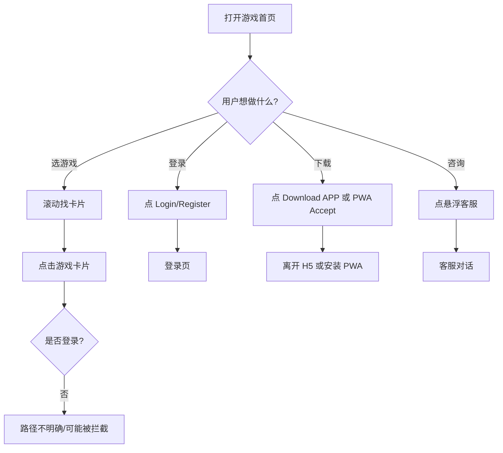
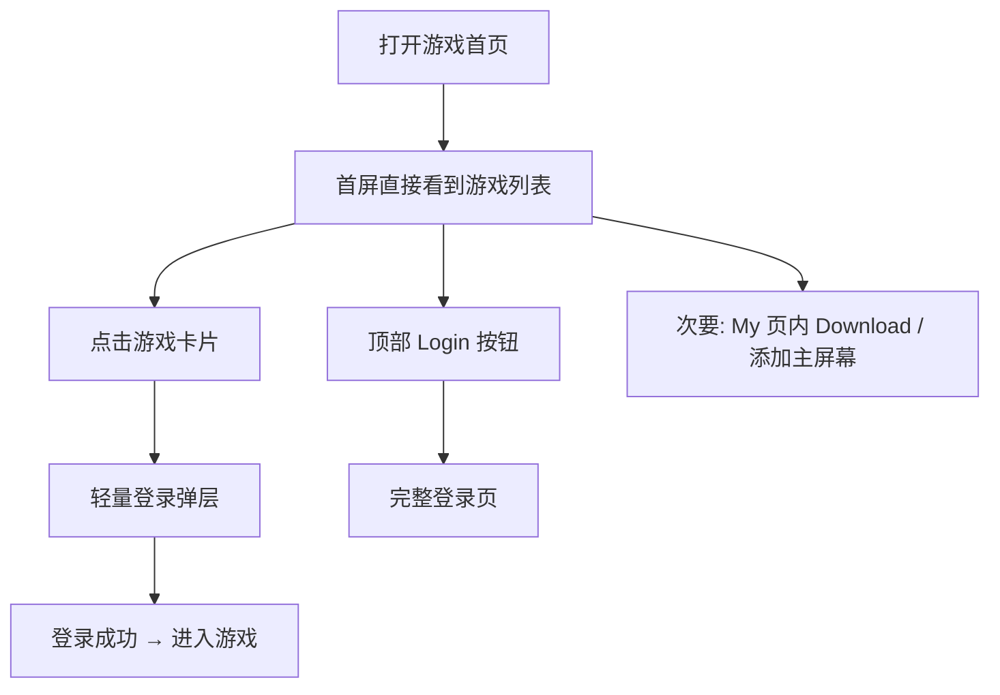

# KingKong H5 交互体验梳理与优化建议

**评测页面：** https://kingkong.ac/mobile.html#/base/game  
**评测时间：** 2026-06-17  
**视角：** 仅交互（用户操作路径、反馈、层级、遮挡）  
**应用版本：** V 1.7.0

---

## 1. 交互概览

KingKong 游戏首页是一个「**多入口、多层导航、多悬浮层**」并存的页面。用户打开 `#/base/game` 后，在**未登录**状态下面对的是「浏览游戏 → 被引导登录/下载/安装」的混合路径，而不是单一的「选游戏 → 进入游戏」路径。

| 交互维度 | 现状 | 优先级 |
|----------|------|--------|
| 主路径是否清晰 | 5+ 个操作入口同时竞争 | P0 |
| 模式切换反馈 | Social / Classic 切换几乎无变化 | P0 |
| 内容是否可操作 | 悬浮层遮挡游戏卡片 | P0 |
| 登录流程 | 表单结构清楚，状态反馈弱 | P1 |
| 底部导航 | 四 Tab 清晰，但与安装条叠加 | P1 |
| 文案是否可理解 | 中英混排、公告截断 | P1 |

---

## 2. 页面交互结构（截图标注）

### 2.1 游戏首页首屏


**当前交互层级（自上而下）：**

```
① 顶栏：Logo | Login/Register | 记录图标
② 营销层：Download APP 横幅（可关闭）
③ 公告层：滚动跑马灯（不可点击展开）
④ 模式层：Social Mode ⇄ Classic Mode
⑤ 分类层：Hot | Live Stream | Community | Poker Room
⑥ 内容层：Banner 轮播 + 游戏卡片网格
⑦ 悬浮层：收藏 | 客服 | 活动（右侧固定）
⑧ 阻断层：PWA 安装条（底部）
⑨ 主导航：Home | Community | Conversation | My
```

**交互问题：** 用户还没开始选游戏，就要先理解 9 层结构；真正可点的「游戏卡片」被推到首屏下半部。

---

### 2.2 登录页


**当前操作路径：**

```
返回 ←  Log in  →  Register（右上角）
        ↓
Country 下拉 → Mobile phone → Password
        ↓
Verification code login    Retrieve password
        ↓
Log in 按钮
        ↓
Online customer service
```

**交互问题：**
- 主按钮在未填完时看起来像「不可点」，用户不确定能否提交
- Register 在右上角，与主流程「登录」距离远，新用户容易漏看
- Country 选了 U.S.A，但用户不一定意识到区号 +1 会随之变化

---

### 2.3 滚动与遮挡


**交互问题：**
- 用户向下滚动浏览游戏时，右侧悬浮条始终挡住右列卡片
- 底部 PWA 安装条与 Tab 栏叠在一起，容易误触「Accept」或 Tab

---

## 3. 核心交互问题梳理

### 3.1 主路径不清晰（P0）

**现象：** 首屏同时引导用户做 5 件不同的事：

| 入口 | 用户预期行为 | 实际冲突 |
|------|--------------|----------|
| Login/Register | 去登录 | 与 Download APP 竞争 |
| Download APP | 去下载原生 App | 与 PWA 安装条重复 |
| PWA Install | 添加到桌面 | 文案写 desktop，移动端困惑 |
| 悬浮客服 | 去咨询 | 遮挡游戏卡片 |
| 游戏卡片 | 进入游戏 | 可能被登录拦截，路径未提前说明 |

**交互建议：**
- 未登录态只保留 **一条主路径**：`浏览游戏 → 点击游戏 → 提示登录 → 登录后进入`
- Login/Register 作为唯一顶部主按钮
- Download / PWA 改为二次引导（首次弹窗或「My」页内），且互斥展示，不要同时出现

---

### 3.2 模式切换无反馈（P0）

**现象：** 点击 Classic Mode 后，页面布局、Banner、游戏列表几乎不变（见截图 07）。


**用户心理：** 「我切换了模式，但什么都没发生 — 是不是点错了？」

**交互建议：**
- 切换时至少改变一项可见内容：Tab 分类、Banner、游戏列表排序
- 增加切换动画或短暂 loading，明确「已切换」
- 当前选中态已有橙色高亮，但内容未联动，选中态意义不足

---

### 3.3 悬浮层干扰主操作（P0）

**现象：**
- 右侧固定工具条覆盖游戏卡片右下角（含收藏心形按钮区域）
- 底部安装条占用 Tab 上方空间，滚动时仍不消失

**交互建议：**
- 悬浮工具条默认 **收成一个 FAB**，点击再展开
- PWA 安装改为 **非阻断 Toast** 或只在第二次访问时出现
- 关闭横幅/安装条后，记住用户选择，当次会话不再弹出

---

### 3.4 分类导航层级重复（P1）

**现象：** 页面上存在两套导航，职责重叠：

| 层级 | 选项 | 作用 |
|------|------|------|
| 模式 Tab | Social / Classic | 切换产品形态 |
| 分类按钮 | Hot / Live / Community / Poker | 切换内容类型 |
| 底部 Tab | Home / Community / Conversation / My | 切换主模块 |

**交互问题：** Community 在分类按钮和底部 Tab 各出现一次，用户不清楚区别。

**交互建议：**
- 明确分工：模式 Tab 管「看什么类型的游戏」，底部 Tab 管「去哪个模块」
- 若 Community 是同一功能，只保留一处入口
- Hot 已有选中态，切换其他分类时应有列表刷新反馈

---

### 3.5 游戏卡片交互（P1）

**现象：**
- 卡片带标签：Game Group Chat / Game Streaming / Game Battle
- 右上角有心形收藏按钮
- 点击卡片本身会做什么，页面上没有说明（进游戏？进房间？需登录？）

**交互建议：**
- 未登录点击卡片：弹出轻量登录引导，而非直接跳转或静默失败
- 收藏按钮与卡片点击区域分离，避免误触（目前收藏按钮靠近悬浮层，更易误操作）
- 标签文案可点击了解含义（如「Game Group Chat」是什么）

---

### 3.6 登录页交互（P1）

**现象：**

| 元素 | 交互状态 | 问题 |
|------|----------|------|
| Log in 按钮 | 浅色渐变 | 像 disabled，用户不敢点 |
| 表单字段 | 无即时校验 | 点提交才知道哪里错 |
| Verification code login | 与主流程同级 | 分流了主路径 |
| Register | 右上角小字 | 发现成本高 |

**交互建议：**
- 按钮区分三种态：**不可点 / 可点 / 加载中**，不可点时也要有足够对比度
- 输入时即时校验（手机号格式、密码长度）
- Register 放到 Log in 按钮下方：「还没有账号？Register」
- Country 变更时，区号字段同步变化并给予短暂提示

---

### 3.7 公告与文案影响操作理解（P1）

**现象：**
- 滚动公告英文被截断，用户读不完，不知道要不要点
- UI 英文 + 游戏中文名混排，操作标签理解成本更高
- PWA 条写「install to desktop」，在手机上不符合用户心智

**交互建议：**
- 公告改为 **可点击展开** 或进入公告列表
- 同一页面统一语言
- 安装引导按场景显示：手机 →「添加到主屏幕」，桌面 →「安装到桌面」

---

## 4. 用户路径梳理

### 4.1 当前路径（未登录）



**问题：** 用户最自然的动作是 C→G，但系统在 A 就同时推 D 和 E，路径分叉过多。

### 4.2 建议路径（未登录）



---

## 5. 交互优化清单

### P0 — 优先改

| # | 问题 | 改什么 | 用户感受 |
|---|------|--------|----------|
| 1 | 入口太多 | 首屏只留 Login + 游戏列表 | 「我知道该干嘛」 |
| 2 | 模式切换无效 | 切换后列表/Banner 要变 | 「切换有反应」 |
| 3 | 悬浮层挡内容 | 改为可收起 FAB | 「点游戏不会误触别的」 |
| 4 | 安装条阻断 | 改 Toast + 记住关闭 | 「不再被挡 Tab」 |

### P1 — 其次改

| # | 问题 | 改什么 |
|---|------|--------|
| 5 | 点游戏不知后果 | 未登录点卡片 → 登录引导 |
| 6 | 登录按钮状态 | 明确 disabled / active / loading |
| 7 | Community 重复 | 合并或区分命名 |
| 8 | 公告不可交互 | 可点击展开 |
| 9 | Register 难发现 | 移到登录按钮下方 |

### P2 — 体验增强

| # | 建议 |
|---|------|
| 10 | 收藏成功后给 toast 反馈 |
| 11 | 分类切换加列表刷新动画 |
| 12 | 底部 Tab 当前页高亮保持一致（Home 已 OK） |

---

## 6. 截图索引

| 文件 | 交互关注点 |
|------|------------|
| `01-initial-load.png` | 首屏入口层级、遮挡关系 |
| `04-login-page.png` | 登录表单、按钮状态、Register 位置 |
| `06-game-scrolled.png` | 滚动浏览时的遮挡 |
| `07-classic-mode.png` | 模式切换反馈缺失 |

---

## 7. 说明

本次梳理基于 **未登录访客态**。登录后「My / Conversation / 钱包」等模块会有更多交互路径，建议在登录态下单独补一版交互地图。

---

*报告视角：交互体验 · Cursor Cloud Agent*
