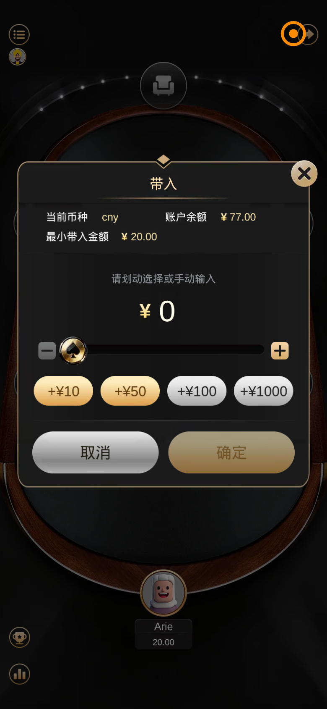
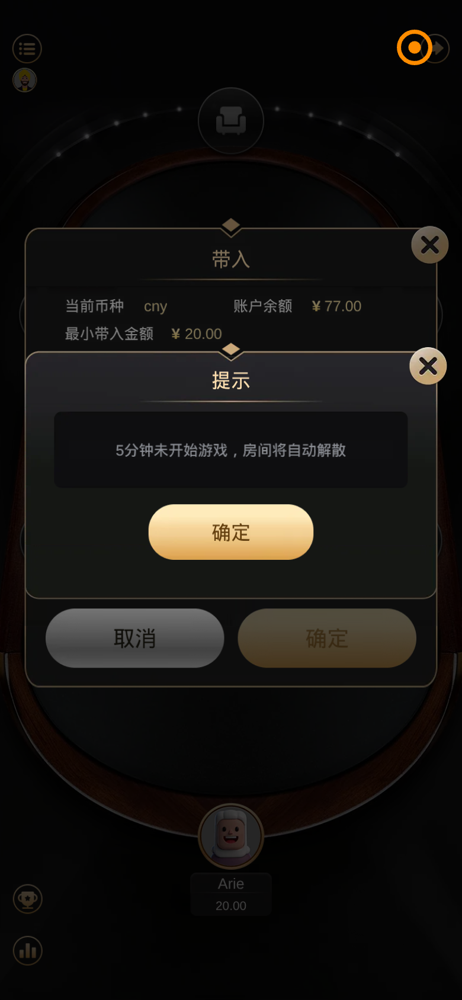

# 金刚牌局 · 炸金花 — 房间 501813 牌桌过程分析报告

**测试地址：** https://kingkong.ac/mobile.html → 牌局 → 炸金花 → 房间 **501813**  
**子应用路由：** `#/detail?room=501813&gameType=1`  
**测试时间：** 2026-06-18  
**视角：** 产品 · 交互 · 视觉  

---

## 流程概览

```
H5 点「炸金花」→ Join 页（创建/加入房间）
  → 输入房号 501813 → #/detail 牌桌（Cocos）
    → 点击空座位 → 「带入」弹窗（选筹码）
      → 确认带入 → 入座等待
        → 满员开局 → 发牌/下注/比牌（本次未能测到）
```

**本次实测结论：** 成功进入房间 501813 并触发入座/带入流程；房间处于 **0/8 局、仅 1 名玩家（Arie）已入座** 的等待态，**未能凑齐人数完成一整局牌**。以下问题覆盖「进房 → 入座 → 等待开局」全过程，并对未能实测的牌局内操作作标注。

---

## 实测路径

| 步骤 | 结果 |
|------|------|
| 登录 → 牌局 → 炸金花 | 进入 `#/join?gameType=1` |
| 点击「加入房间」→ 输入 501813 | 键盘弹层出现，但 Canvas 坐标输入未触发进房 |
| 直链 `#/detail?room=501813&gameType=1` | ✅ 成功进入牌桌 |
| 点击空座位 | 弹出「带入」弹窗 |
| 尝试确认带入 / 等待开局 | 默认带入 ¥0；房间提示 5 分钟未开局将解散 |
| 完整一局牌局 | ❌ 人数不足，未进入发牌/下注阶段 |




---

## 产品问题

1. **带入默认值低于最小限额**：弹窗显示最小带入 ¥20，但默认选中 **¥0**，用户不清楚必须手动调高才能入座。
2. **5 分钟解散规则曝光过晚**：「5 分钟未开始游戏，房间将自动解散」在点击座位后才弹出，进房前/Join 页无任何预告。
3. **局数 vs 回合双计数**：牌桌同时展示「局数 0/8」与「回合 0/10」，两套进度语义重叠，用户难理解哪个决定牌局结束。
4. **等待态与已有玩家矛盾**：中央横幅写「座位空缺中，恭候您的加入」，但底部已有玩家 **Arie（20.00）** 入座，文案像「完全空房」。
5. **Join 房号流程不可靠**：加入房间键盘输入 6 位房号后未自动进房（实测需改 URL 才成功），产品路径存在断点。
6. **单人不发牌**：仅 1 人在座时无任何「还需 N 人才能开始」的明确说明，只有空座位图标。
7. **帐号 `%Jimmy` 仍出现**：Join 页顶栏帐号名带 `%` 前缀，贯穿进房流程。
8. **余额体系**：带入弹窗显示 ¥77，与 H5 顶栏 KKC 关系未说明。

---

## 交互问题

1. **带入「确定」与规则冲突**：金额为 ¥0 时「确定」按钮仍为金色可点样式，与「最小 ¥20」规则不一致，用户可能误点后才发现无法入座。
2. **双层弹窗抢焦点**：「5 分钟解散」提示叠在「带入」弹窗之上，需先关提示才能操作带入，打断主流程。
3. **带入交互路径长**：入座 = 点座位 → 弹窗 → 滑杆/快捷金额 → 确定，无「一键最小带入」默认填充。
4. **快捷金额与余额不匹配**：余额 ¥77 时仍展示 **+¥1000** 按钮（部分截图中未置灰），点击预期需有禁用/提示。
5. **分享 / 菜单 / 统计图标**：点击后界面变化不明显，缺少明确反馈（是否打开面板、复制房号等）。
6. **退出仅图标**：右上角橙色退出箭头无文字，与 H5 关闭钮、牌局菜单形成第三套退出语义。
7. **房号键盘无确认**：与牛牛相同，6 位输满后是否自动提交不明确。
8. **未能验证的操作**（需多人/真机）：下注、跟注、弃牌、比牌、抢庄、倒计时 — 本次因未开局未覆盖。



---

## 视觉问题

1. **弹窗模板复用**：「带入」「5 分钟解散提示」共用同一套深色框 + 金按钮，严重级别无法区分。
2. **带入金额 ¥0 视觉权重过大**：大号金色「¥ 0」比最小限额 ¥20 更醒目，引导方向错误。
3. **牌桌信息密度高**：Logo + 游戏名 + 房号 + 底分 + 局数 + 玩法 + 回合挤在牌桌中央，小屏阅读吃力。
4. **中英文混排**：「KING KONG」英文 Logo 与全中文规则信息同屏，品牌层级不统一。
5. **空座 vs 已座样式差异大**：空位为灰色椅图标，已座为卡通头像，但空位无「点击入座」文字提示。
6. **字体不统一**：Cocos 牌桌字体与 Join 页 PingFang / 目标 SF Pro 不一致。
7. **等待横幅遮挡牌桌**：「恭候您的加入」横条覆盖桌面中心，遮挡部分规则文字。

---

## 与用户截图对照（房间 501813）

用户提供的真机截图与自动化结果一致：

- 房间号 **501813**、玩法 **炸金花**、底分 **1.00**、局数 **0/8**、常规模式
- 5 个空座位 + 中央等待文案
- 顶部菜单 / 分享，底部奖杯 / 统计入口

自动化额外捕获：**点击座位 → 带入弹窗**、**5 分钟解散提示**，为用户截图未展示的后续步骤。

---

## 截图索引

| 文件 | 说明 |
|------|------|
| `screenshots/zhajinhua-room-501813/01-join-keypad-page.png` | 炸金花 Join 页 |
| `screenshots/zhajinhua-room-501813/03-direct-detail-page.png` | 进入 501813 牌桌 |
| `screenshots/zhajinhua-room-501813/04-table-loaded-page.png` | 牌桌等待态（含 Arie） |
| `screenshots/zhajinhua-room-501813/05-seat-top-page.png` | 点击座位 → 带入弹窗 |
| `screenshots/zhajinhua-room-501813/06-minimize-page.png` | 5 分钟解散提示叠层 |
| `screenshots/zhajinhua-room-501813/play-report.json` | 自动化原始数据 |

---

## Figma 设计文件

详见 **汇总** 页 Slide 17：

- [Slide 17 · 炸金花 · 牌桌游戏（501813）](https://www.figma.com/design/T8PcoyyXrzMoNM5YFlrTJU?node-id=96-2)
